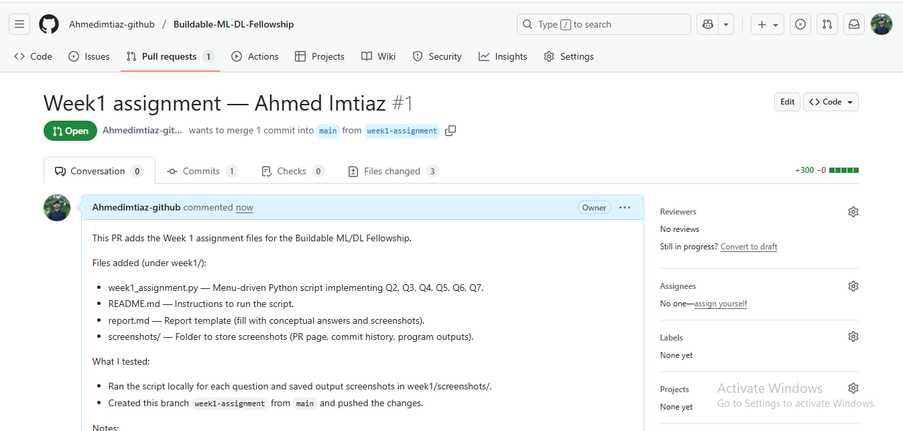
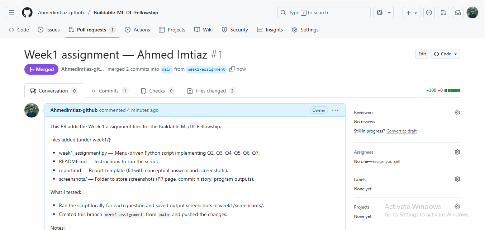
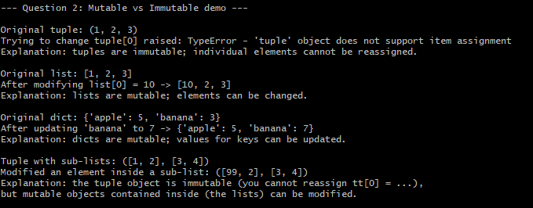
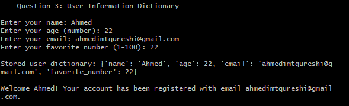
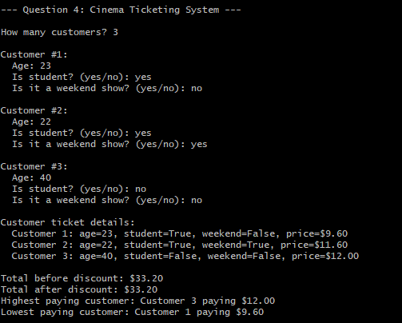
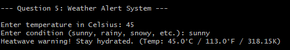
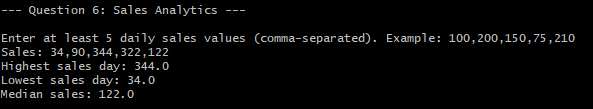
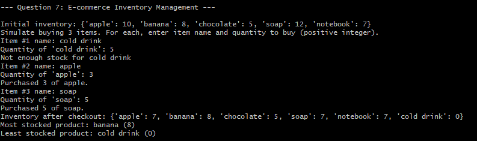

# Week 1 Report
**Name:** Ahmed Imtiaz  
**Repository:** Buildable-ML-DL-Fellowship  
**Branch:** week1-assignment  
**Date:** 2025-08-22

---

## Contents
1. Summary  
2. Code files  
3. Question outputs (screenshots)  
4. Conceptual answers (Question 9)  
5. How to run  
6. Notes

---

## 1. Summary
This repository contains Week 1 solutions for the Buildable ML/DL Fellowship. Implementations are in `week1/week1_assignment.py`. Screenshots of outputs and Git operations are in `week1/screenshots/`.

---

## 2. Code files
- `week1/week1_assignment.py` — All code solutions for Questions 2, 3, 4, 5, 6, 7.  
- `week1/README.md` — How to run the script.  
- `week1/report.md` — This report.  
- `week1/screenshots/*` — Required screenshots.

---

## 3. Question outputs (screenshots)

### Git / GitHub evidence
- **Branch created:** `branch_creation.png`  
  

- **Commit history:** `commit_history.png`  
  

- **Pull request page:** `pr_page.png`  
  

- **PR merged confirmation:** `pr_merged.png`  
  

### Program outputs (one screenshot per question)
- **Q2 — Mutable vs Immutable:** `q2.png`  
  

- **Q3 — User info validation:** `q3.png`  
  

- **Q4 — Cinema ticketing system:** `q4.png`  
  

- **Q5 — Weather alerts:** `q5.png`  
  

- **Q6 — Sales analytics:** `q6.png`  
  

- **Q7 — Inventory management:** `q7.png`  
  

---

## 4. Conceptual answers (Question 9)

### AI, Machine Learning, Deep Learning, Data Science
- **Artificial Intelligence (AI):** The broad field of creating systems that perform tasks that normally require human intelligence.  
  *Example:* Rule-based chatbots, game AIs.

- **Machine Learning (ML):** Subfield of AI where models learn from data to make predictions or decisions.  
  *Example:* A spam classifier trained on labeled emails.

- **Deep Learning (DL):** Subset of ML using multi-layer neural networks to learn hierarchical representations.  
  *Example:* Convolutional Neural Networks for image recognition.

- **Data Science:** Interdisciplinary practice combining programming, statistics, and domain expertise to extract insights and support decisions.  
  *Example:* Using customer transaction logs to predict churn and recommend retention strategies.

---

### Mutable vs Immutable
- **Mutable** objects can be changed after creation (e.g., `list`, `dict`, `set`).  
  - Example from code: modifying `lst[0]` in a list changes the list in-place.
- **Immutable** objects cannot be changed after creation (e.g., `tuple`, `str`, `int`).  
  - Example from code: `t[0] = 10` raises `TypeError`.
- **Subtle case:** a `tuple` can hold mutable objects (e.g., lists). You cannot reassign `tt[0]`, but you can modify `tt[0][0]` if it is a list — this is shown in Q2.

---

### Shallow copy vs Deep copy
- **Shallow copy:** copies the container, but nested mutable objects are shared. Use `copy.copy()` or `list.copy()` for lists.  
  - Problem: changing a nested list affects both copies.
- **Deep copy:** recursively copies all nested objects. Use `copy.deepcopy()` when you need independent nested structures.

---

### Git branching and why it matters
- **What:** Branching creates an isolated line of development for features/assignments.  
- **Why:** Allows you to work without breaking `main`, enables PR reviews, and keeps history clean.  
- **Workflow used:** create `week1-assignment` branch → commit files → push → open PR → merge into `main`.

---

## 5. How to run
1. Clone repository:
